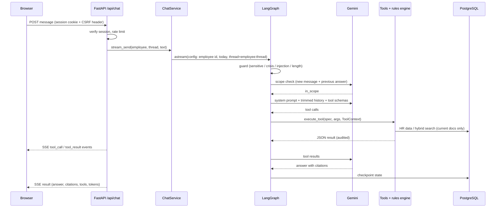
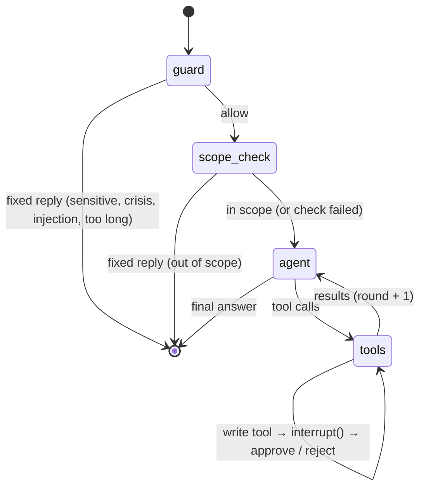

# Architecture

An HR assistant for authenticated employees. It answers policy questions from the company's
**current** policy documents with citations, answers questions about the employee's **own** HR
data, decides eligibility with **deterministic rules**, and takes two actions (submit a leave
request, open an HR ticket) **only after the employee approves**.

## 1. Design principles

| Principle | How it shows up |
|---|---|
| Agent only where it adds value | One LangGraph agent decides *which* tools to call and how to explain the results. Dates, arithmetic, eligibility and permissions are plain Python. |
| Identity comes from the server, never the model | Tools get the employee from the authenticated session (`ToolContext`). Their argument schemas have no employee field and reject unknown fields. |
| Facts come from systems of record | Policy answers come from retrieved passages, and personal answers from the HR data provider. The model is told never to fill gaps from general knowledge. |
| Controlled autonomy | Tool-round limit, per-turn and per-tool timeouts, write actions behind `interrupt()` confirmation, idempotent writes. |
| Confidentiality | Policy PDFs, eval cases about them and transcribed rule values stay in git-ignored folders. CI fails if any are committed. Embeddings are computed locally. |
| Replaceable parts | The LLM provider, embedding model, document source and HR system each sit behind a small interface. |

## 2. System context

```mermaid
flowchart LR
    E[Employee<br/>browser] -->|Google SSO / session cookie| API
    subgraph Local deployment (Docker Compose)
      API[FastAPI app<br/>API + web UI + agent]
      DB[(PostgreSQL 16<br/>+ pgvector)]
      API --- DB
    end
    API -->|ID token verification| G[Google OIDC]
    API -->|chat completions + tools| LLM[Gemini API<br/>configurable provider]
    API -.->|optional traces| LS[LangSmith]
    P[/Policy PDFs<br/>git-ignored folder/] -->|ingestion CLI| DB
```

PostgreSQL holds everything: the mock HR system of record, the policy registry and chunks
(full-text vectors plus pgvector embeddings), the audit log, and LangGraph conversation
checkpoints.

## 3. Components

```
app/
  api/        HTTP: auth (Google OIDC, dev login, sessions, CSRF), chat (SSE), health, errors
  agent/      LangGraph graph, guardrails, prompts (versioned), ChatService, runtime wiring, LLM factory
  tools/      Tool specs (Pydantic schemas) + guarded executor (validation, timeout, audit)
  domain/     HR read models and the rules engine (calendar, leave, WFH, loan, certification, location)
  hr/         HRDataProvider port, mock DB implementation, seed, demo provisioning
  rag/        Document source, PDF parsing, metadata/versioning, chunking, embeddings, ingestion, retriever
  db/         SQLAlchemy models, async session; migrations/ (Alembic)
  observability/  Audit sink
web/          Single-page UI (vanilla JS, strict CSP)
evals/        Evaluation cases, scorer, runner
```

## 4. A chat turn



For a write tool the graph stops at `interrupt()`. The UI shows an Approve/Reject card, and
`POST /api/chat/confirm` resumes the graph from the Postgres checkpoint, even after a restart.

## 5. The agent graph



- **Guard** runs deterministic checks before the model. A personal disclosure ("I am being
  harassed…") gets a reviewed reply routing to HR, with an offer to open a confidential ticket.
  An informational question about the policy goes through.
- **Scope check** makes one small structured model call (`{in_scope: bool}`) on the new message
  plus the previous answer, so follow-ups like "what about Bengaluru?" stay in scope. Off-topic
  questions (trivia, coding, news) end with a fixed reply and are never answered. It fails open:
  if the call errors or is rate-limited, the agent handles the turn under its own prompt rules.
  `SCOPE_CHECK_ENABLED=false` removes the node (saves one request per message). Messages with
  plain HR terms (leave, holiday and festival names, loan, policy, ...) and short follow-ups
  to an HR answer skip the call: cheaper, and no false refusals of questions like "When is
  Diwali?".
- **Agent** makes one model call with tools bound. After `AGENT_MAX_TOOL_ROUNDS` (default 6) the
  model is called without tools and must answer with what it has.
- **Tools** run through `execute_tool`: argument validation, timeout (default 8s), typed errors,
  and an audit record.

Why one agent and not several: see [ADR-002](adr/0002-single-agent-with-deterministic-tools.md).

## 6. Knowledge: policy ingestion and retrieval

1. **Source:** `LocalFolderSource` reads `data/private_policies/*.pdf`. A SharePoint, Drive or S3
   source would implement the same protocol.
2. **Parse:** PyMuPDF extracts text with page numbers and removes repeated headers and footers.
3. **Metadata:** title, version and effective date come from each PDF's "Document and Version
   History" table (or revision block). The location (Chennai, Karnataka, USA) comes from the
   title. Policies that cover only some locations (e.g. the leave policy, written for the India
   entity) get an `applies_to` list from `policy_scope.yaml` (private, with a fictional example
   in `data/seed/`).
4. **Versioning:** documents are grouped by normalised policy name, and the newest date (then
   version) is `current`. Older versions are kept as `superseded` with no chunks, so they can
   never be retrieved.
5. **Holiday lists** are parsed row by row into the `holidays` table.
6. **Chunking:** section-aware, about 320 words with 40 words of overlap, with each chunk
   prefixed by "title — sections".
7. **Embeddings** are computed locally with fastembed (`bge-small-en-v1.5`, 384-d).
8. **Retrieval** fuses Postgres full-text search (OR-query, `ts_rank_cd`) and pgvector cosine
   with reciprocal rank fusion, filtered to current documents and the employee's location.
   Policies scoped to other locations stay searchable, but each passage says whether it
   `applies_to_you`; the system prompt also names the policies that do not cover the employee.
9. **Re-indexing** is keyed on the content hash plus an index signature (embedding model and
   chunker version).

## 7. Data model (main tables)

| Table | Purpose |
|---|---|
| `employees`, `leave_types`, `leave_balances`, `leave_requests`, `holidays`, `wfh_days`, `staff_loans`, `hr_tickets` | Mock HR system of record (fictional people) |
| `documents`, `document_chunks` | Policy registry (version, status, location, `applies_to`) and chunks (`tsvector`, `vector(384)`) |
| `audit_log` | Every tool call, approval and login: who, what, outcome, latency; free text redacted |
| `checkpoint*` (LangGraph) | Conversation state per `employee:thread` |

## 8. Security

| Threat | Mitigation |
|---|---|
| Unauthenticated access | Google OIDC code flow with state and nonce. The ID token is verified against Google's JWKS (issuer, audience, expiry), and only the allowed Workspace domain is accepted via the signed `hd` claim. Sessions are signed `HttpOnly` `SameSite=Lax` cookies, 8 hours by default. |
| CSRF | State-changing endpoints require an `X-Requested-With` header, on top of SameSite. |
| Accessing another employee's data | Identity is injected from the session. Tool schemas carry no employee field and reject unknown fields (tested). Conversation threads are namespaced by employee (tested). |
| Prompt injection (direct) | Pattern guard before the model, and the system prompt states that tool output is data. Even a successful injection cannot widen access, because tools enforce identity and writes need approval. |
| Indirect injection via documents | Passages are labelled as reference data. Only the employee's own data is reachable, and writes need explicit approval. |
| Excessive agency | Only 2 write tools. Both pause for approval, are re-validated server-side and are idempotent. |
| Leaking internals | Error envelope with no stack traces. Tool errors are typed and internal exceptions are hidden from the model (tested). |
| XSS | All rendering is HTML-escaped. CSP `script-src 'self'` with no inline script. `frame-ancestors 'none'`. |
| Abuse and cost | Per-employee rate limit, input length limit, tool-round limit and timeouts. |
| Confidential data in git | Git-ignored private folders, a CI guard, and Docker mounts read-only at runtime (never baked into the image). |
| Secrets | `.env` is git-ignored. `SESSION_SECRET` is required outside local development. API keys are read only from the environment. |

**Data sent to third parties:** policy excerpts and questions go to the LLM provider. On the
Gemini free tier Google may use them to improve its products, which is a known trade-off of the
zero-cost choice; a paid tier or a private deployment removes it. LangSmith tracing is off by
default.

## 9. Reliability

- **LLM:** SDK retries with backoff (`LLM_MAX_RETRIES`), a request timeout, and a turn timeout
  with a clean error to the user.
- **Tools:** per-tool timeout. Invalid arguments are returned to the model as `invalid_arguments`
  so it can correct itself. Unknown tools are reported, not crashed on.
- **Loops:** tool-round cap, then a forced final answer, plus a graph recursion limit.
- **Writes:** idempotency keys. A retried submission returns the original request. Rules are
  re-checked before writing.
- **State:** Postgres checkpoints, so pending approvals survive restarts (tested).
- **Degraded start:** if the LLM key or the database is missing, the app still serves `/health`;
  `/ready` and chat report what is missing.

## 10. Observability

- **Structured JSON logs** with `request_id` on every line. Each turn logs its tools, tool
  errors, tokens, estimated cost, guardrail outcome and prompt version.
- **Turn results** include each tool's arguments and outcome, the citations, tokens and the prompt
  version. The UI shows them under "Used N tools" above each answer.
- **Audit log table** for tool calls, approvals and logins.
- **Optional LangSmith traces** (`LANGSMITH_TRACING=true`) with run tags and a hashed employee
  reference; `LANGSMITH_HIDE_IO=true` masks content.

Together these answer: why did the agent decide this (tool arguments plus verdict findings with
policy references), what influenced it (citations, tool outputs), what failed (error codes), what
it cost (tokens and estimate), and why it stopped (final answer, limit, guardrail or pending
approval).

## 11. Evaluation

- **Tests:** about 130 unit and integration tests run in CI against Postgres, using a scripted
  model for agent behaviour.
- **Eval suite** (`evals/`): 33 public cases plus private cases that assert policy facts. They are
  scored by deterministic checks: tools chosen, arguments, answer content, citations, guardrail,
  confirmation status and tool-call budget. An optional LLM judge checks groundedness. Results go
  to [`eval-results.md`](eval-results.md).

## 12. Cost

The default is Gemini Flash on the free tier, so the cost is zero.
- A typical turn uses 2–4 model calls (one is the small scope check).
- Retrieval sends only the top 5 passages, at most 2,500 characters each.
- History is trimmed to the last 24 messages.
- Embeddings are local and free.
- If moved to a paid tier, set `LLM_COST_*_PER_MTOK_USD` to get per-turn cost estimates in logs
  and results.

## 13. Deployment

- **Local (current):** Docker Compose with `db` (pgvector), a one-shot `migrate`, `api`, and an
  `evals` profile.
- **AWS target (not built; outline):**
  - ECS Fargate service behind an ALB with HTTPS (ACM)
  - RDS PostgreSQL with pgvector
  - Secrets Manager for keys and the session secret
  - S3 as the policy `DocumentSource`, with an ingestion task triggered by EventBridge on upload
  - CloudWatch logs and metrics; WAF on the ALB
  - Bedrock as an alternative LLM provider (a factory change)
  - Redis (ElastiCache) for the rate limiter once there is more than one replica

## 14. Known limitations

- HR data is a **mock**. An official employee-portal (iAssistant) API would replace
  `DbHRDataProvider`.
- Sensitive-topic and injection guardrails are pattern-based. A classifier model would improve
  recall on subtle cases (the scope check already uses the model for off-topic questions).
- Some policies contradict themselves (e.g. EL encashment in v1.3). The agent cites the text
  rather than resolving it, and those cases should go to HR.
- Real-model behaviour has been evaluated with the eval suite only where a Gemini key was
  available. See [`eval-results.md`](eval-results.md).
